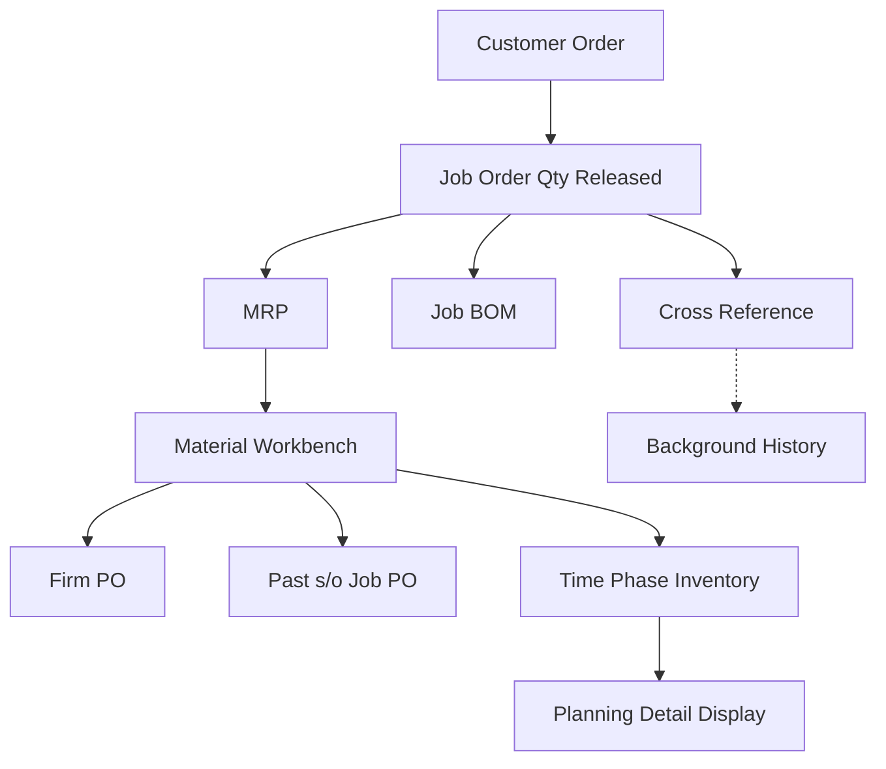

# MRP & Manufacturing Flow Diagram

Digital reconstruction from whiteboard photo (2026-06-12)

---

## Mermaid Flowchart

---

## Node Definitions

| Node | Label | Role |
|------|-------|------|
| CO | Customer Order | Entry point — incoming demand |
| JOQR | Job Order Qty Released | Released production quantities |
| MRP | Material Requirements Planning | Central planning engine |
| MW | Material Workbench | Material allocation & PO management hub |
| JB | Job BOM | Bill of Materials for job |
| CR | Cross Reference | Part/item cross-reference lookup |
| BH | Background History | Historical reference data (dashed link) |
| FPO | Firm PO | Confirmed purchase orders |
| PSO | Past s/o Job PO | Overdue/past sales order POs |
| TPI | Time Phase Inventory | Time-phased inventory projection |
| PDD | Planning Detail Display | Final planning output/report |

---

## Flow Logic

1. **Demand Entry**: Customer Order triggers Job Order Qty Released
2. **Parallel Processing**: Released quantities feed both Job BOM (materials needed) and Cross Reference (part matching)
3. **MRP Engine**: Central MRP consumes released quantities, outputs to Material Workbench
4. **Material Workbench** branches three ways:
   - **Firm PO** — confirmed procurement
   - **Past s/o Job PO** — backlog clearance
   - **Time Phase Inventory** — forward-looking inventory projection
5. **Output**: Time Phase Inventory feeds Planning Detail Display (reporting/visibility)

---

## Notes

- Dashed line `CR -.-> BH` indicates Cross Reference may optionally consult Background History
- `Past s/o Job PO` likely represents legacy/overdue POs that need resolution before new MRP runs complete
- Consider adding feedback loop from Planning Detail Display back to MRP for closed-loop planning