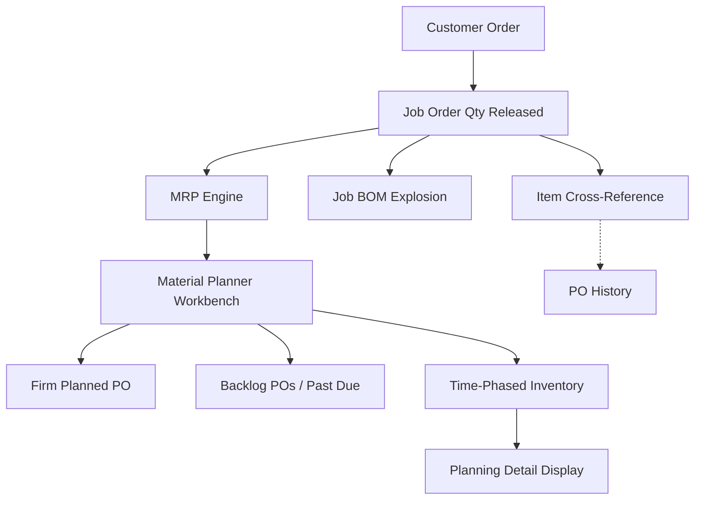

📋 *สถานะโครงการโดยรวม*

| โครงการ | สถานะ | ความคืบหน้า | ปัญหา/ตัวบล็อก |
| --- | --- | --- | --- |
| MRP (Infor Food Pkg) | 🟢 ตามแผน | ดำเนินการประชุมวางแผนและแก้ไขปัญหารายสัปดาห์เรียบร้อยแล้ว | - |
| Returnable Box 🎨 | 🔴 ติดบล็อก | พัฒนาระบบแจ้งเตือนเบื้องหลังและปรับปรุง UI เสร็จสมบูรณ์ | ข้อมูลเชื่อมโยงระหว่าง Article number และ Material number ในระบบ MES ขาดหายไป |
| Move Apps (Project) | 🟢 ตามแผน | ไม่มีอัปเดตในสัปดาห์นี้ (เจ็บป่วย งดเข้าปฏิบัติงานนอกสถานที่) | — |
| TPK QA Hold | 🟡 กำลังดำเนินการ | ไม่มีอัปเดตในสัปดาห์นี้ (ปรับเปลี่ยนสถานะเป็นกำลังดำเนินการใหม่) | — |
| Store Ink | 🟡 กำลังดำเนินการ | ไม่มีอัปเดตในสัปดาห์นี้ (ปรับเปลี่ยนสถานะเป็นกำลังดำเนินการใหม่) | — |

## 📋 สรุปภาพรวมสำหรับผู้บริหาร

📌 **จันทร์ 8 มิถุนายน - เสาร์ 13 มิถุนายน 2569** — ความคืบหน้าโครงการ Returnable Box: ปรับปรุงระบบแจ้งเตือนเบื้องหลังให้ทำงานได้ตามปกติ พร้อมจัดตำแหน่งและปรับปรุงไอคอนกระดิ่งความละเอียดสูง จัดการ UI/UX หลายส่วน (เช่น ปรับขนาดแท็บแบบไดนามิก, แก้ไขสโครลบาร์ของฟอร์ม, จัดสไตล์ปุ่มสร้าง Lot, ปิดการคลิกหน้าแท็บ tpOther, และทำพื้นหลังเลเบลแผงข้อมูลให้โปร่งใส) ปัจจุบันติดบล็อกในส่วนการค้นหาขนาด (dimension criteria search) เนื่องจากไม่มีซอฟต์แวร์เชื่อมโยงข้อมูลระหว่าง Article number และ Material number ในระบบ MES; โครงการ Move Apps: ไม่มีอัปเดตในสัปดาห์นี้เนื่องจากเจ็บป่วยและงดเข้าปฏิบัติงานในไซต์; โครงการ TPK QA Hold และ Store Ink: ปรับสถานะเป็น "กำลังดำเนินการ" (In Progress) ทั้งสองโครงการ โดยยังไม่มีอัปเดตฟังก์ชันงานในสัปดาห์นี้; โครงการ MRP: ดำเนินการประชุมทบทวนแผนงานและแก้ไขปัญหา (troubleshooting) ครอบคลุมเรื่อง Material Planner Workbench, PO Requisition และโครงสร้าง BOM (Current, Standard, Job) พร้อมทั้งเขียนแผนภาพลำดับการผลิต (MRP → Manufacturing Flow Diagram) บนกระดานไวท์บอร์ด

## 🚀 งานที่เสร็จสิ้นสัปดาห์นี้ (8–13 มิถุนายน 2569)

- ✅ [Box] การแจ้งเตือนและปรับปรุง UI — กู้คืนระบบแจ้งเตือนเบื้องหลังพร้อมจัดตำแหน่งไอคอนกระดิ่งความละเอียดสูงให้อยู่กึ่งกลาง, ปรับขนาดแท็บตามความยาวหัวข้อแบบไดนามิก, แก้ไขสโครลบาร์ในฟอร์ม, จัดสไตล์ปุ่มสร้าง Lot, ปิดการเลือกแท็บหลอก tpOther, และปรับพื้นหลังข้อมูลให้โปร่งใส
- ✅ [MRP] การประชุมและการแก้ไขปัญหารายสัปดาห์ (12 มิ.ย.) — ทบทวนส่วนงาน Material Planner Workbench (ฟอร์ม Generation & Workbench) และ Purchase Order Requisition ร่วมแก้ข้อสงสัยแนวคิดระบบ CSI (DTS, สถานะ Firming, Forecast consumption, Pegging/Orphaned demand) และเขียนแผนผังลอจิกขั้นตอนการผลิตบนไวท์บอร์ด (MRP → Manufacturing Flow Diagram)
- 🟡 [ShopFloor] TPK QA Hold — ปรับเปลี่ยนสถานะเป็น "กำลังดำเนินการ" ยังไม่มีความคืบหน้าอื่นในสัปดาห์นี้
- 🟡 [StoreInk] Scrap — ปรับเปลี่ยนสถานะเป็น "กำลังดำเนินการ" ยังไม่มีความคืบหน้าอื่นในสัปดาห์นี้
- 🔴 [Box] ติดบล็อก: รายละเอียดการวิเคราะห์การค้นหาตามขนาด (BOXSOFT client mapping) — เนื่องจาก Article number และ Material number ไม่มีระบบหรือซอฟต์แวร์เชื่อมโยงถึงกันใน MES

---

## 📊 แผนผังกระบวนการผลิตและระบบ MRP (MRP & Manufacturing Flow Diagram)

### คำอธิบายลอจิกกระบวนการ:
1. **Demand Entry (บันทึกความต้องการ)**: Customer Order จะสร้างรายการ Job Order Qty Released (ผ่านฟอร์ม: *Job Order Create*)
2. **Parallel Processing (การประมวลผลคู่ขนาน)**: ดำเนินการระเบิดสูตรการผลิต Job BOM Explosion (ความต้องการวัตถุดิบ) ร่วมกับ Item Cross-Reference (พาร์ททดแทน)
3. **MRP Engine (ระบบประมวลผล MRP)**: รันระบบแบบคำนวณใหม่ทั้งหมด (regeneration) หรือคำนวณเฉพาะส่วนต่าง (net-change) แล้วส่งผลลัพธ์ใบสั่งผลิตที่วางแผนไว้ไปยัง *Material Planner Workbench*
4. **Material Planner Workbench (โต๊ะงานผู้วางแผนวัตถุดิบ)**: แยกออกเป็นประเภทใบสั่งผลิตที่ยืนยันแล้ว (Firm Planned POs), ใบสั่งผลิตที่ค้างส่ง/เลยกำหนด (Backlog POs / Past Due) และมุมมองแสดงระดับสินค้าคงคลังตามช่วงเวลา (Time-Phased Inventory view)
5. **Output (ผลลัพธ์)**: ข้อมูล Time-Phased Inventory จะป้อนเข้าสู่ฟอร์ม *Planning Detail Display* เพื่อการตรวจสอบขั้นตอนสุดท้าย

---

## 🖥 รายชื่อระบบและโปรแกรมย้ายระบบ (Move Apps — Project List)

*รายละเอียดของแต่ละระบบที่ใช้งาน: database server, SQL instance, สิทธิ์การเชื่อมต่อฐานข้อมูล (connection credentials) และเส้นทางเก็บไฟล์ config*

| โปรแกรม | สถานะ | ผู้เขียน | SQL Instance | ฐานข้อมูล | ผู้ใช้ | หมายเหตุ |
| --- | --- | --- | --- | --- | --- | --- |
| Outsource | Tracking (ติดตามงาน) | Phutorn | 192.168.10.19\SQLEXPRESS02 | TPNprinting | sa | IP Address ของพี่ภูธร: 192.168.6.189 |
| OutsourceMobile | Tracking (ติดตามงาน) | Phutorn | — | — | — | \\\\192.168.10.2\ShareCenter\Program\Outsource\config.json |
| StockTPN | Tracking (ติดตามงาน) | Phutorn | 192.168.10.19\SQLEXPRESS02 | InventoryRMTPK | storerm | \\\\192.168.95.200\Store\StoreRM\config.json |
| StoreTPN | Tracking (ติดตามงาน) | Phutorn | — | InventoryTPK | — | เหมือน StockTPN |
| AI | Done (เสร็จสิ้น) | Manoon | eset.tpk.thsg (192.168.57.38) MySQL | QC_Hand | root | AI QC/ASM — ข้อมูลผลิตจริง |
| Parameter Viewer | Done (เสร็จสิ้น) | Manoon | PDDB.tpk.thsg (192.168.10.17) MySQL | Target_speed_DB | root | โฮสต์ TPN |
| QC_HandSET | Done (เสร็จสิ้น) | Manoon | PDDB.tpk.thsg\SQLEXPRESS | QC_Hand | sa | ประกอบ/หยอดกาว |

---

## 🥅 แผนงานสัปดาห์หน้า

- [MRP] ตรวจสอบขั้นตอนการเคลียร์ Sale Order (SO) และ Purchase Order Requisition (PR)
- [Move Apps] เริ่มย้ายแอปพลิเคชันของพี่ภูธร (Outsource, StockTPN, ฯลฯ)
- [Box] เชื่อมโยงโฟลว์แจ้งเตือน: ฝ่ายผลิต (Production) → ใบส่งสินค้า (Delivery Order) → แจ้งเตือนยอดสินค้าสำเร็จรูปคลังสินค้า (Stock FG)
- [Box] ออกแบบวิเคราะห์ฟังก์ชันการค้นหาตามขนาด
- [Box] อัปเดตคู่มือผู้ใช้งานและคู่มือสำหรับนักพัฒนา

---

## 🔥 บันทึกเตือนความจำ

- ย้ายแอป: สำเร็จแล้ว 3 จาก 7 โปรแกรม คงเหลือ: Outsource, OutsourceMobile, StockTPN, StoreTPN (ซึ่งเป็นแอปของพี่ภูธรทั้งหมด)
- ย้ายแอป: กำหนดเส้นตาย 1 เดือน (หรืออย่างน้อยที่สุด 2 สัปดาห์) ไฟล์แชร์ตั้งอยู่ที่: TPNDBAPP21 (192.168.10.2) → Share Center → Program (ฝั่ง TPN) และ \\192.168.57.39\software\F_PROJECT (ฝั่ง TPK)
- ย้ายแอป: BOXSOFT instance = TPK-REGULUS, ฐานข้อมูล = csgwin-tpk
- ระบบกล่อง: การค้นหาตามขนาด ติดบล็อกเนื่องจากไม่มีระบบเชื่อมโยงระหว่าง Article number และ Material number ในระบบ MES

*อัปเดตโดย วุฒิพงษ์ ณ วันที่ 13 มิถุนายน 2569*
