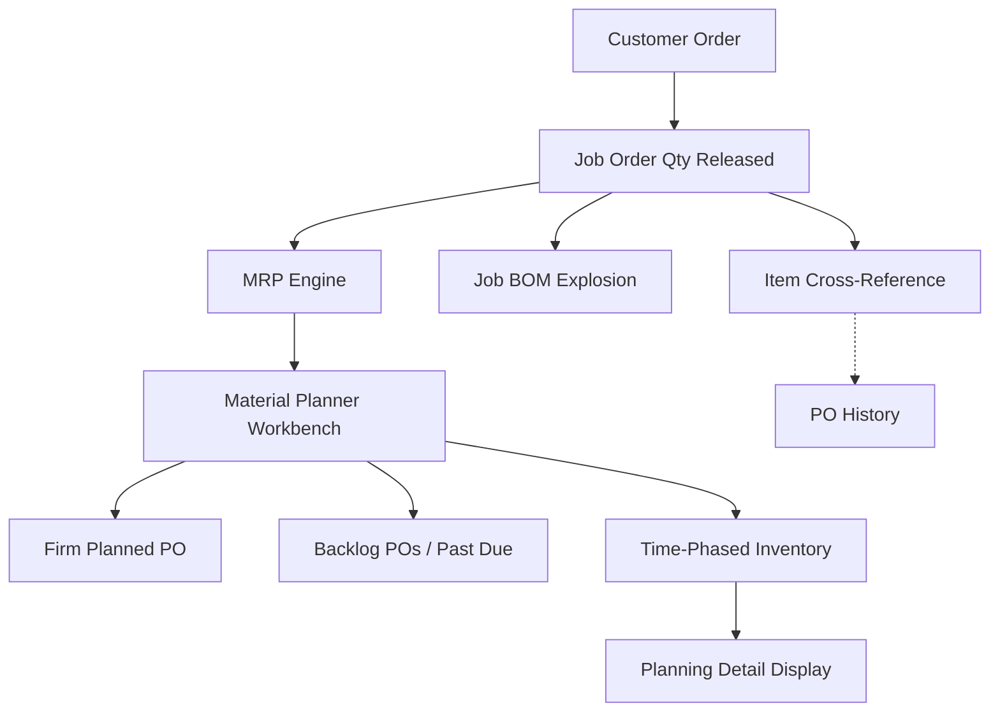

📋 *STATUS AT A GLANCE*

| Project | Status | Key Update | Blocker |
| --- | --- | --- | --- |
| MRP (Infor Food Pkg) | 🟢 On Track | Weekly planning meeting & troubleshooting conducted | - |
| Returnable Box 🎨 | 🔴 Blocked | Background notifications and UI enhancements completed | Article/Material number link missing in MES |
| Move Apps (Project) | 🟢 On Track | No updates this week (unwell, no on-site visits) | — |
| TPK QA Hold | 🟡 In Progress | No updates this week (newly marked in progress) | — |
| Store Ink | 🟡 In Progress | No updates this week (newly marked in progress) | — |

## 📋 Executive Summary

📌 **Mon 8 June - Sat 13 June** — Returnable Box progress: Restored background notifications with high-definition bell icon drawing and centering. Completed multiple UI/UX enhancements (dynamic tab sizing, form scrollbar fixes, lot generator button styling, tpOther tab click restriction, and cleaned up info panel label transparency). Blocked on dimension criteria search: Article and Material numbers have no linking software in MES. Move Apps: No updates this week (unwell, no on-site visits). TPK QA Hold & Store Ink: Both projects transitioned to "In Progress" status; no functional updates this week. MRP: Held weekly planning review and troubleshooting session covering Material Planner Workbench, PO Requisition, and BOM structures (Current, Standard, Job). Mapped out the MRP → Manufacturing Flow Diagram on the whiteboard.

## 🚀 This Week (June 8–13, 2026)

- ✅ [Box] Notifications & UI Enhancements — Restored background notifications with high-definition bell icon centering, dynamic tab sizing, form scrollbar fixes, styled lot generator button, disabled dummy tpOther tab, and cleaned up info panel label transparency
- ✅ [MRP] Weekly Meeting & Troubleshooting (June 12) — Reviewed Material Planner Workbench (Generation & Workbench forms) and Purchase Order Requisition. Addressed CSI concepts (DTS, Firming status, Forecast consumption, Pegging/Orphaned demand) and mapped out the Whiteboard Review (MRP → Manufacturing Flow Diagram)
- 🟡 [ShopFloor] TPK QA Hold — Transitioned to "In Progress" status; no updates this week
- 🟡 [StoreInk] Scrap — Transitioned to "In Progress" status; no updates this week

- 🔴 [Box] Blocked: Dimension criteria dig-in (BOXSOFT client mapping) — Article and Material numbers have no linking software in MES

---

## 📊 MRP & Manufacturing Flow Diagram

### Flow Logic:
1. **Demand Entry**: Customer Order triggers Job Order Qty Released (form: *Job Order Create*)
2. **Parallel Processing**: Job BOM Explosion (material requirements) + Item Cross-Reference (alternate parts)
3. **MRP Engine**: Runs regeneration or net-change; outputs planned orders to *Material Planner Workbench*
4. **Material Planner Workbench**: Branches into Firm Planned POs, Backlog POs (past due), and Time-Phased Inventory view
5. **Output**: Time-Phased Inventory feeds *Planning Detail Display* for final visibility

---

## 🛠 Easy Issue Troubleshooting

### Issue 1: Ref Type is (Blank) for JOB...
1. Select the **Customer Orders** form
2. Input the Order: #K*2487
3. Click **Filter In Place**
4. Go to **Lines**: #1 (at the right bar menu side)
5. Go to **Releases**: #1
6. Go to **Source**
7. Click the **References** tab and set: Destination = Order, Order Number = #K000012487, Order Line = #1, Order Release = #1

*Note: The cross-references on top of the error specify the Order Line and Order Release numbers.*

### Issue 2: PO Requisition Line that has x does not exist...
1. Select the **Job Orders** form
2. Input the **Job**
3. Click the **Filter** icon
4. Go to **Operations**
5. Go to **Materials**
6. Click the **Source** tab and set the Source to **Inventory**

---

🖥 *Move Apps — Project List*

*What each project uses: database server, SQL instance, connection credentials, and config file locations*

| Program | Status | Writer | SQL Instance | Database | User | Remark |
| --- | --- | --- | --- | --- | --- | --- |
| Outsource | Tracking | Phutorn | 192.168.10.19\SQLEXPRESS02 | TPNprinting | sa | Phutorn's IP Address 192.168.6.189 |
| OutsourceMobile | Tracking | Phutorn | — | — | — | \\\\192.168.10.2\ShareCenter\Program\Outsource\config.json |
| StockTPN | Tracking | Phutorn | 192.168.10.19\SQLEXPRESS02 | InventoryRMTPK | storerm | \\\\192.168.95.200\Store\StoreRM\config.json |
| StoreTPN | Tracking | Phutorn | — | InventoryTPK | — | Same as StockTPN |
| AI | Done | Manoon | eset.tpk.thsg (192.168.57.38) MySQL | QC_Hand | root | AI QC/ASM — prod data |
| Parameter Viewer | Done | Manoon | PDDB.tpk.thsg (192.168.10.17) MySQL | Target_speed_DB | root | TPN host |
| QC_HandSET | Done | Manoon | PDDB.tpk.thsg\SQLEXPRESS | QC_Hand | sa | Assembly/Glue |

---

## 🥅 Next Week

- [MRP] Walkthrough clearing Sale Order (SO), Purchase Order Requisition (PR)
- [Move Apps] Begin migration of P'Phutorn's apps (Outsource, StockTPN, etc.)
- [Box] Wire up notification flow: Production → Delivery Order → Stock FG alert
- [Box] Dimension search functionality mapping
- [Box] Update User Manual & Developer Guide

---

## 🔥 Notes to Self

- Move Apps: 3/7 done. Remaining: Outsource, OutsourceMobile, StockTPN, StoreTPN (all P'Phutorn's apps)
- Move Apps: 1 month deadline (or at least 2 weeks). Shared files: TPNDBAPP21 (192.168.10.2) → Share Center → Program (TPN) and \\192.168.57.39\software\F_PROJECT (TPK)
- Move Apps: BOXSOFT instance = TPK-REGULUS, DB = csgwin-tpk
- Box: Dimension search: blocked because Article and Material numbers have no linking software in MES

## 🔗 References

- **Notion Page**: [MRP - Infor Food Packaging](https://app.notion.com/p/MRP-Infor-Food-Packaging-3680da1b1be6807b9d22ce2a5a212ad0?source=copy_link)
- **Slack Canvas**: [Weekly (June 8–13, 2026)](https://flexpakhq.slack.com/docs/T0AMK5LU20P/F0BABJ39FJ6)

*Updated by Wuttipong on 2026-06-13*
