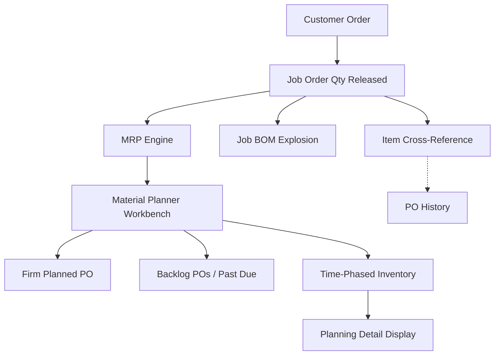

# Memory Bridge (smith): artifacts / 2026-06-19-weekly-report-june-15-19

## Bridge Source
- Workspace: `/Users/Jeff/Smith`
- Relative path: `memory/artifacts/2026-06-19-weekly-report-june-15-19.md`
- Kind: `markdown`
- Agents: smith
- Updated: 2026-06-19T15:46:07.898Z

## Content
````markdown
📋 *STATUS AT A GLANCE*

| Project | Status | Key Update | Blocker |
| --- | --- | --- | --- |
| MRP (Infor Food Pkg) | 🟢 On Track | Daily 2:00 PM planning cleanup & workbench troubleshooting (Test DB) |  |
| Returnable Box 🎨 | 🟢 On Track | Background notification flow completed | Article/Material number link missing in MES |
| Move Apps (Project) | 🔴 Blocked | Outsource git initialized and config decoupled. Blocker: Centralized database design prevents migration until site hosting decision (TPN vs TPK) is made. | Centralized database design for TPN & TPK requires decision on which site hosts database and configuration. |
| TPK QA Hold | 🟢 On Track | Clean architecture refactoring & UI modernization completed | — |
| Store Ink | 🟡 In Progress | No updates this week (newly marked in progress) | — |

## 📋 Executive Summary

📌 *Mon 15 June - Fri 19 June* — Returnable Box: Completed the real-time notification flow (Production → Delivery Order → Stock FG alert) using SignalR and custom DI on Consumable.vb. Client PCs now auto-connect on load. Handled Structured JSON payloads, centralized native desktop toast alerts, and resolved multi-threaded UI badge update issues using thread-safe marshalling. Switched primary hub routing to .100 with fallback to localhost. TPK QA Hold: Transitioned to active development. Refactored the legacy C# project into Clean Architecture (Core, Infrastructure, Presentation layers) and decoupled database access and Excel export logic into repositories. Modernized the WinForms UI via FormModernizer.cs to apply a flat, modern slate dashboard theme (flat TextBox/ComboBox, custom-painted GroupBox/Panel/TabControl borders, custom ToolStripRenderer for menus with highlights, consistent label/radio button colors, themed calendar popups, and light SplitContainer backgrounds). Replaced hardcoded SteelBlue/(64,64,64) colors with slate theme on frmMain.Designer.cs, updated buttons (emerald/amber/blue/rose), redesigned tab drawing (selected white bg with indigo accent, unselected dark), and updated frmQAlert.Designer.cs (Segoe UI font + slate color). MRP (Infor Food Pkg): Supported the Food Packaging team with daily 2:00 PM on-site troubleshooting sessions for the Material Planner Workbench using the Test Database environment. Purged outdated planning data and resolved obsolete item flags by changing item statuses to "Stopped" and moving old transaction data to history to minimize MRP generation clutter. Conducted an on-site visit at TPK (9:00 AM – 11:00 AM) and met with the ERP Manager (11:00 AM – 12:00 PM) to align on MRP system processes and configuration. Store Ink: No updates this week.

## 🚀 This Week (June 15–19, 2026)

- ✅ [Box] Notification flow completed — Integrated SignalR notification service, client auto-connect, structured payloads, and thread-safe UI badge updates
- ✅ [ShopFloor] TPK QA Hold Architecture — Refactored to Clean Architecture, decoupled database access, and injected flat dashboard UI theme via FormModernizer
- ✅ [ShopFloor] TPK QA Hold UI Modernization — Expanded FormModernizer.cs to cover flat TextBox (clean borders, read-only gray state), flat ComboBox, custom GroupBox borders (no more 3D bevels), modern TabControl padding, dark slate StatusStrip, custom ToolStripRenderer for Menu/ToolStrips with hover highlights, consistent Label/RadioButton text, themed calendar popup, flat Panel borders, and light SplitContainer bg. Replaced hardcoded SteelBlue/(64,64,64) with slate palette and updated buttons (emerald/amber/blue/rose) in frmMain.Designer.cs, redesigned tab drawing with white bg + indigo accent bar (unselected stay dark, close button uses ×) in frmMain.cs, and updated frmQAlert.Designer.cs to Segoe UI + slate.
- ✅ [MRP] Daily Workbench Troubleshooting & Cleanup — Ran daily 2:00 PM on-site sessions in the Test Database with the Food Packaging planners to debug the Material Planner Workbench, clean up out-of-date recommendations, set obsolete item statuses to "Stopped", and archive legacy order history to streamline MRP runs.
- ✅ [MRP] ERP Manager Alignment Meeting — Conducted an on-site visit at the TPK site (9:00 AM – 11:00 AM) and met with the ERP Manager (11:00 AM – 12:00 PM) to align on MRP system configurations, processes, and database setups.
- 🔴 [Move Apps] Blocked: Outsource Migration — Initialized Git, decoupled config to use env variable, configured VS Code debugging, and deployed v1.0.0.64. However, migration is now blocked because the database was designed for both sites (TPN and TPK) as one shared place. A decision is required on which site will store the database and config.
- 🟡 [StoreInk] Scrap — No updates this week
- 🔴 [Box] Blocked: Dimension criteria dig-in — Article and Material numbers have no linking software in MES

---

## 📊 MRP & Manufacturing Flow Diagram



### Flow Logic:

1. *Demand Entry*: Customer Order triggers Job Order Qty Released (form: Job Order Create)
2. *Parallel Processing*: Job BOM Explosion (material requirements) + Item Cross-Reference (alternate parts)
3. *MRP Engine*: Runs regeneration or net-change; outputs planned orders to Material Planner Workbench
4. *Material Planner Workbench*: Branches into Firm Planned POs, Backlog POs (past due), and Time-Phased Inventory view
5. *Output*: Time-Phased Inventory feeds Planning Detail Display for final visibility

---

## 🛠 Easy Issue Troubleshooting

### Issue 1: Ref Type is (Blank) for JOB...

1. Select the *Customer Orders* form
2. Input the Order: #K*2487
3. Click *Filter In Place*
4. Go to *Lines*: #1 (at the right bar menu side)
5. Go to *Releases*: #1
6. Go to *Source*
7. Click the *References* tab and set: Destination = Order, Order Number = #K000012487, Order Line = #1, Order Release = #1

*Note: The cross-references on top of the error specify the Order Line and Order Release numbers.*

### Issue 2: PO Requisition Line that has x does not exist...

1. Select the *Job Orders* form
2. Input the *Job*
3. Click the *Filter* icon
4. Go to *Operations*
5. Go to *Materials*
6. Click the *Source* tab and set the Source to *Inventory*

### Issue 3: Outdated planning recommendation (Job/PR) remains active for an item...

1. Select the *Material Planner Workbench* form
2. Uncheck *Purchase Order* (or select off the Purchase Order filter)
3. Uncheck *All Orders* filter in the Filter group
4. Select the target item on the table (e.g., `#K0002666`)
5. **Deactivating and Archiving the Source Job**:
    1. Click the *Time Phased* button
    2. Click the *Source* button
    3. Click the *Job* button
    4. Change the status to *Stopped*
    5. Click the *Save* button
    6. Change the status to *History*
    7. Click the *Save* button again to archive
6. **Stopping Outdated Purchase Requisitions (PR)**:
    1. Click the *Planning Detail* button
    2. Find the item which has outdated/old yearly Purchase Requisitions (PRs)
    3. Select the *Purchase Order Requisitions* form
    4. Input the Requisition number (e.g., `#R680000197`)
    5. Click *Filter In Place*
    6. Change the status to *Stopped*
    7. Click the *Save* button
    8. Click *Save* again if prompted

---

🖥 _Move Apps — Project List_

_What each project uses: database server, SQL instance, connection credentials, and config file locations_

| Program | Status | Writer | SQL Instance | Database | User | Remark |
| --- | --- | --- | --- | --- | --- | --- |
| Outsource | Tracking | Phutorn | 192.168.10.19\\SQLEXPRESS02 | TPNprinting | sa | Phutorn's IP Address 192.168.6.189 |
| OutsourceMobile | Tracking | Phutorn | — | — | — | \\\\192.168.10.2\\ShareCenter\\Program\\Outsource\\config.json |
| StockTPN | Tracking | Phutorn | 192.168.10.19\\SQLEXPRESS02 | InventoryRMTPK | storerm | \\\\192.168.95.200\\Store\\StoreRM\\config.json |
| StoreTPN | Tracking | Phutorn | — | InventoryTPK | — | Same as StockTPN |
| AI | Done | Manoon | eset.tpk.thsg (192.168.57.38) MySQL | QC_Hand | root | AI QC/ASM — prod data |
| Parameter Viewer | Done | Manoon | PDDB.tpk.thsg (192.168.10.17) MySQL | Target_speed_DB | root | TPN host |
| QC_HandSET | Done | Manoon | PDDB.tpk.thsg\\SQLEXPRESS | QC_Hand | sa | Assembly/Glue |

---

## 🥅 Next Week

- [ShopFloor] TPK QA Hold — Implement core business logic for hold entry and search
- [Move Apps] Resolve TPN vs TPK database hosting decision for Outsource migration
- [Box] Dimension search functionality mapping
- [Box] Update User Manual & Developer Guide
- [StoreInk] Scrap — Begin implementation of issue for disposal transaction
- [MRP] Clear backlog Customer Orders (CO), Purchase Order Requisition (PR), and optimize workbench profiles (using Test DB)

---

## 🔥 Notes to Self

- Move Apps: 3/7 done. Remaining: Outsource, OutsourceMobile, StockTPN, StoreTPN (all P'Phutorn's apps)
- Move Apps: 1 month deadline (or at least 2 weeks). Shared files: TPNDBAPP21 (192.168.10.2) → Share Center → Program (TPN) and \\\\192.168.57.39\\software\\F_PROJECT (TPK)
- Move Apps: BOXSOFT instance = TPK-REGULUS, DB = csgwin-tpk
- Box: Dimension search: blocked because Article and Material numbers have no linking software in MES
- MRP: Currently operating on the Test Database environment for workbench simulation and cleanup.

## 🔗 References

- *Notion Page*: https://app.notion.com/p/MRP-Infor-Food-Packaging-3680da1b1be6807b9d22ce2a5a212ad0?source=copy_link
- *Slack Canvas (Previous)*: https://flexpakhq.slack.com/docs/T0AMK5LU20P/F0BABJ39FJ6

_Updated by SMITH on 2026-06-19_

````

## Notes
<!-- openclaw:human:start -->
<!-- openclaw:human:end -->

## Related
<!-- openclaw:wiki:related:start -->
- No related pages yet.
<!-- openclaw:wiki:related:end -->
