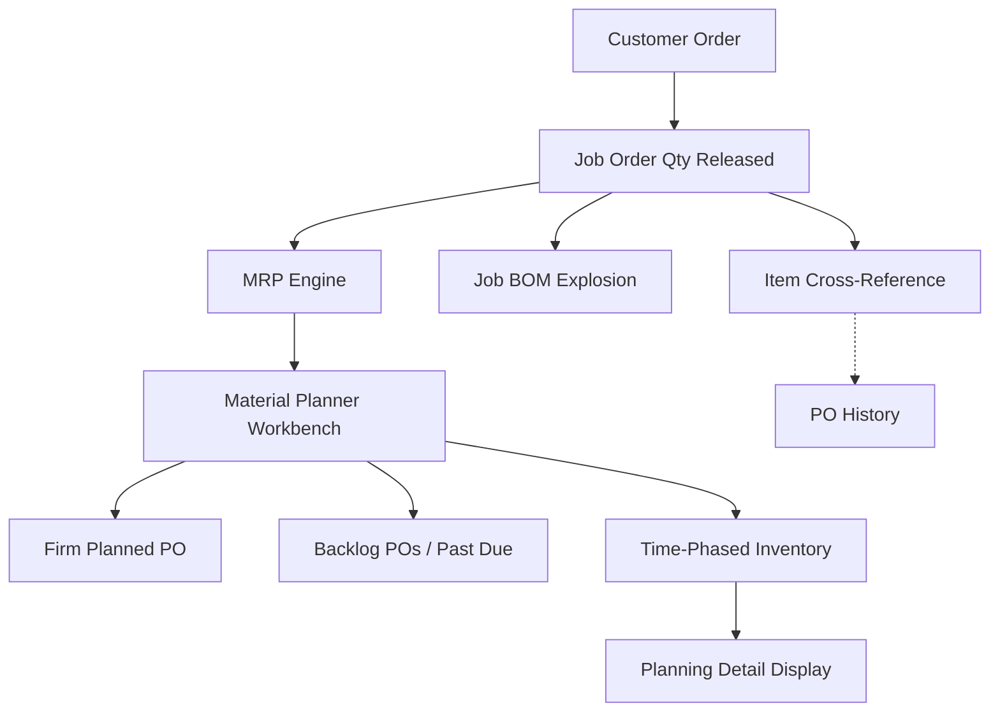

# Memory Bridge (smith): artifacts / 2026-06-19-weekly-report-june-15-19-th

## Bridge Source
- Workspace: `/Users/Jeff/Smith`
- Relative path: `memory/artifacts/2026-06-19-weekly-report-june-15-19-th.md`
- Kind: `markdown`
- Agents: smith
- Updated: 2026-06-19T15:46:07.898Z

## Content
````markdown
📋 *สถานะโครงการโดยรวม*

| โครงการ | สถานะ | ความคืบหน้า | ปัญหา/ตัวบล็อก |
| --- | --- | --- | --- |
| MRP (Infor Food Pkg) | 🟢 ตามแผน | แก้ปัญหาและเคลียร์ข้อมูล Planner Workbench รายวันเวลา 14:00 น. (ฐานข้อมูลทดสอบ) |  |
| Returnable Box 🎨 | 🟢 ตามแผน | ระบบส่งสัญญาณแจ้งเตือนเบื้องหลังเสร็จสมบูรณ์ | ข้อมูลเชื่อมโยงระหว่าง Article number และ Material number ในระบบ MES ขาดหายไป |
| Move Apps (Project) | 🔴 ติดบล็อก | เตรียม Git และแยก config ของแอป Outsource แล้ว ติดบล็อก: โครงสร้างฐานข้อมูลถูกออกแบบแบบรวมศูนย์ (centralized) ทำให้ไม่สามารถย้ายระบบได้จนกว่าจะได้ข้อสรุปเรื่องโฮสต์ที่ใช้เก็บข้อมูลและ config (TPN หรือ TPK) | ฐานข้อมูลถูกออกแบบร่วมกันสำหรับ TPN และ TPK ต้องรอตัดสินใจเลือกไซต์ที่จะเก็บฐานข้อมูลและไฟล์ config |
| TPK QA Hold | 🟢 ตามแผน | ปรับปรุงโครงสร้างเป็น Clean Architecture และปรับแต่งหน้าตา UI ใหม่เสร็จสิ้น | — |
| Store Ink | 🟡 กำลังดำเนินการ | ไม่มีอัปเดตในสัปดาห์นี้ (ปรับเปลี่ยนสถานะเป็นกำลังดำเนินการใหม่) | — |

## 📋 สรุปภาพรวมสำหรับผู้บริหาร

📌 **จันทร์ 15 มิถุนายน - ศุกร์ 19 มิถุนายน 2569** — Returnable Box: พัฒนาระบบส่งสัญญาณแจ้งเตือนแบบเรียลไทม์ (Production → Delivery Order → Stock FG alert) เสร็จสมบูรณ์ผ่าน SignalR และ Custom DI บน Consumable.vb ให้เครื่องฝั่งไคลเอนต์สามารถเชื่อมต่อเซิร์ฟเวอร์โดยอัตโนมัติเมื่อเปิดแอปพลิเคชัน จัดการโครงสร้างข้อมูลแบบ JSON Payload, รวมศูนย์การแสดงผลแจ้งเตือนผ่าน Desktop Toast บนวินโดวส์ และแก้ไขการอัปเดตตัวเลขแจ้งเตือนบน UI แบบข้ามเธรด (multi-threaded UI badge update) โดยใช้การจัดคิวเธรดที่ปลอดภัย (thread-safe marshalling) พร้อมตั้งค่าการเชื่อมต่อหลักไปที่เซิร์ฟเวอร์ .100 และใช้ localhost เป็นเครื่องสำรอง TPK QA Hold: ปรับสถานะเป็นพัฒนาจริง (active development) ดำเนินการจัดโครงสร้างโค้ดใหม่เป็น Clean Architecture (แยกส่วน Core/Domain, Infrastructure และ Presentation) พร้อมแยกโค้ดเขียนข้อมูลเข้าฐานข้อมูลและส่งออก Excel ออกจาก UI หลักเข้าสู่ส่วน Repository ด้านการออกแบบ ได้เพิ่ม FormModernizer.cs เพื่อปรับแต่งหน้าจอ WinForms ให้เป็นธีม Slate Dashboard แบบแบนที่ทันสมัย (ปรับปรุง TextBox/ComboBox แบบแบน, เขียนขอบ GroupBox/Panel/TabControl ขึ้นใหม่, พัฒนา ToolStripRenderer สำหรับแถบเมนูให้แสดงไฮไลต์เวลาเมาส์ชี้, ปรับสีข้อความ Label/RadioButton, ใช้ปฏิทินแบบมีธีม และปรับพื้นหลัง SplitContainer) นอกจากนี้ได้เปลี่ยนสี SteelBlue และ (64,64,64) ในหน้า frmMain.Designer.cs เป็นสี Slate, อัปเดตสีปุ่มตามบริบท (เขียวมรกต/ส้ม/น้ำเงิน/ชมพูกุหลาบ), วาดหน้าแท็บใหม่ (แท็บที่เลือกใช้พื้นหลังขาวแถบสีน้ำเงินคราม แท็บอื่นใช้สีเข้ม และใช้ตัวคูณ × ปิดแท็บ) และจัดสไตล์หน้าแจ้งเตือน frmQAlert.Designer.cs ด้วยฟอนต์ Segoe UI คู่กับสีธีม Slate MRP (Infor Food Pkg): ร่วมมือกับทีมงานวางแผนแผนก Food Packaging เพื่อแก้ปัญหาและทำความสะอาดระบบ Material Planner Workbench ประจำวันเวลา 14:00 น. ผ่านระบบฐานข้อมูลทดสอบ (Test Database) ดำเนินการเคลียร์ข้อมูลแผนการผลิตเก่าที่หมดอายุและปรับปรุงสถานะไอเทมที่ยกเลิกใช้งานเป็น "Stopped" พร้อมโอนย้ายรายการบันทึกประวัติการทำธุรกรรมเก่าเก็บเข้าสู่ History เพื่อลดความหนาแน่นและข้อมูลขยะในการประมวลผล MRP และเดินทางเข้าปฏิบัติงานในไซต์ TPK ช่วงเช้า (09:00 - 11:00 น.) พร้อมเข้าประชุมกับผู้จัดการฝ่าย ERP (11:00 - 12:00 น.) เพื่อตรวจสอบขั้นตอนการทำงานและการกำหนดค่าของระบบ MRP Store Ink: ไม่มีอัปเดตในสัปดาห์นี้

## 🚀 งานที่เสร็จสิ้นสัปดาห์นี้ (15–19 มิถุนายน 2569)

- ✅ [Box] ระบบส่งสัญญาณแจ้งเตือนสำเร็จ — บูรณาการระบบแจ้งเตือนผ่าน SignalR, ตั้งค่าฝั่งไคลเอนต์ให้เชื่อมต่ออัตโนมัติ, รองรับโครงสร้างข้อมูล JSON และปรับเปลี่ยนสถานะตัวเลขแจ้งเตือนแบบ thread-safe บน UI
- ✅ [ShopFloor] ปรับปรุงโครงสร้าง TPK QA Hold — รีแฟกเตอร์สถาปัตยกรรมสู่ Clean Architecture, แยกส่วนการเชื่อมต่อฐานข้อมูล และปรับปรุงดีไซน์เป็นธีม Dashboard ผ่าน FormModernizer
- ✅ [ShopFloor] ปรับปรุงหน้าจอ TPK QA Hold UI — ขยายขอบเขตของ FormModernizer.cs เพื่อปรับแต่งหน้าจอ WinForms (TextBox ขอบแบนสถานะอ่านอย่างเดียวสีเทา, ComboBox ดีไซน์แบน, ลบขอบ 3D นูนของ GroupBox/Panel/TabControl, ปรับแต่งแถบสถานะ StatusStrip สี Slate, พัฒนา ToolStripRenderer สำหรับเมนูทางลัดพร้อมไฮไลต์, ปรับสีข้อความ Label/RadioButton, ใช้ปฏิทินคลังข้อมูลสี Slate, และปรับแก้พื้นหลัง SplitContainer) เปลี่ยนโทนสี SteelBlue และสีเทาเดิมในหน้า frmMain.Designer.cs เป็นสี Slate พร้อมปรับแต่งปุ่มต่างๆ เป็นสีตามบริบท (เขียวมรกต/ส้ม/น้ำเงิน/กุหลาบ) ปรับเปลี่ยนการวาดสีแท็บใน frmMain.cs (พื้นหลังขาวแถบน้ำเงินเมื่อเลือก แท็บไม่เลือกใช้สีทึบ และเปลี่ยนเครื่องหมายปิดเป็น ×) ปรับปรุงฟอร์ม alert ย่อย frmQAlert ให้เป็นฟอนต์ Segoe UI และโทนสี Slate
- ✅ [MRP] การทำความสะอาดข้อมูลระบบและแก้ไขปัญหาประจำวัน — ดำเนินงานร่วมกับผู้วางแผน Food Packaging ประจำวันเวลา 14:00 น. บนฐานข้อมูลทดสอบ เพื่อตรวจสอบและปรับแก้ไข Material Planner Workbench, เคลียร์ข้อมูลการวางแผนเก่า, ปรับสถานะไอเทมที่หมดอายุเป็น "Stopped" และย้ายบันทึกประวัติเก่าเข้าสู่ History เพื่อเตรียมระบบสำหรับประมวลผล MRP
- ✅ [MRP] ประชุมร่วมกับผู้จัดการฝ่าย ERP — เดินทางเข้าไซต์ TPK (09:00 - 11:00 น.) และประชุมร่วมกับ ERP Manager (11:00 - 12:00 น.) เพื่อตรวจสอบขั้นตอนการทำงาน โครงสร้างของข้อมูล และความถูกต้องของระบบ MRP
- 🔴 [Move Apps] ติดบล็อก: การย้ายแอป Outsource — เริ่มต้นใช้งาน Git, แยก config เพื่อใช้งานผ่าน env variable, ตั้งค่าความพร้อมสำหรับตรวจสอบบั๊กผ่าน VS Code และติดตั้งเวอร์ชัน 1.0.0.64 ลงบน TPKShare เรียบร้อย อย่างไรก็ดี การย้ายโปรแกรมติดบล็อกเนื่องจากฐานข้อมูลเดิมถูกออกแบบให้ใช้งานร่วมกันระหว่างสองไซต์ (TPN และ TPK) ในจุดเดียว จำเป็นต้องตัดสินใจเลือกไซต์ที่จะวางโครงสร้างฐานข้อมูลและค่า config
- 🟡 [StoreInk] Scrap — ไม่มีอัปเดตในสัปดาห์นี้
- 🔴 [Box] ติดบล็อก: การค้นหาข้อมูลตามขนาด — เนื่องจากรหัส Article และรหัส Material ไม่มีระบบหรือซอฟต์แวร์เชื่อมโยงข้อมูลเข้าหากันใน MES

---

## 📊 แผนผังกระบวนการผลิตและระบบ MRP (MRP & Manufacturing Flow Diagram)



### คำอธิบายลอจิกกระบวนการ:

1. *Demand Entry (บันทึกความต้องการ)*: Customer Order จะสร้างรายการ Job Order Qty Released (ผ่านฟอร์ม: *Job Order Create*)
2. *Parallel Processing (การประมวลผลคู่ขนาน)*: ดำเนินการระเบิดสูตรการผลิต Job BOM Explosion (ความต้องการวัตถุดิบ) ร่วมกับ Item Cross-Reference (พาร์ททดแทน)
3. *MRP Engine (ระบบประมวลผล MRP)*: Runs regeneration หรือ net-change แล้วส่งผลลัพธ์ใบสั่งผลิตที่วางแผนไว้ไปยัง *Material Planner Workbench*
4. *Material Planner Workbench (โต๊ะงานผู้วางแผนวัตถุดิบ)*: แยกออกเป็นประเภทใบสั่งผลิตที่ยืนยันแล้ว (Firm Planned POs), ใบสั่งผลิตค้างส่ง/เลยกำหนด (Backlog POs / Past Due) และมุมมองแสดงระดับสินค้าคงคลังตามช่วงเวลา (Time-Phased Inventory view)
5. *Output (ผลลัพธ์)*: ข้อมูล Time-Phased Inventory จะป้อนเข้าสู่ฟอร์ม *Planning Detail Display* เพื่อการตรวจสอบขั้นตอนสุดท้าย

---

## 🛠 คำแนะนำขั้นตอนการแก้ไขปัญหาเบื้องต้น (Easy Issue Troubleshooting)

### Issue 1: ปัญหา Ref Type แสดงค่าว่าง (Blank) สำหรับ JOB...

1. เปิดฟอร์ม *Customer Orders*
2. ใส่รหัส Order: #K*2487
3. คลิกปุ่ม *Filter In Place*
4. ไปที่เมนูย่อย *Lines*: #1 (แถบเมนูด้านขวามือ)
5. ไปที่เมนูย่อย *Releases*: #1
6. ไปที่แถบหน้าต่าง *Source*
7. คลิกแท็บ *References* และกำหนดค่า: Destination = Order, Order Number = #K000012487, Order Line = #1, Order Release = #1

*หมายเหตุ: ข้อมูลอ้างอิงข้าม (cross-references) ที่ระบุอยู่บนหน้าจอแจ้งเตือนจะระบุหมายเลข Order Line และ Order Release ที่ต้องการแก้ไข*

### Issue 2: ปัญหาแจ้งเตือน PO Requisition Line (x) ไม่มีอยู่จริง...

1. เปิดฟอร์ม *Job Orders*
2. ใส่รหัส *Job*
3. คลิกไอคอน *Filter*
4. ไปที่รายการย่อย *Operations*
5. ไปที่รายการย่อย *Materials*
6. คลิกแท็บ *Source* และตั้งค่า Source เป็น *Inventory*

### Issue 3: รายการวางแผนการผลิตเก่าที่ล้าสมัย (Job/PR) ยังค้างและแสดงอยู่ในระบบสำหรับสินค้า...

1. เปิดฟอร์ม *Material Planner Workbench*
2. เอาเครื่องหมายถูกออกจากตัวเลือก *Purchase Order*
3. เอาเครื่องหมายถูกออกจากตัวเลือก *All Orders* ในกลุ่มตัวกรอง
4. เลือกรายการไอเทมในตาราง (ตัวอย่างเช่น `#K0002666`)
5. **การปิดใช้งานและจัดเก็บข้อมูลใบสั่งผลิต (Source Job)**:
    1. คลิกปุ่ม *Time Phased*
    2. คลิกปุ่ม *Source*
    3. คลิกปุ่ม *Job*
    4. เปลี่ยนสถานะ (Status) เป็น *Stopped*
    5. คลิกปุ่ม *Save*
    6. เปลี่ยนสถานะ (Status) เป็น *History*
    7. คลิกปุ่ม *Save* อีกครั้งเพื่อจัดเก็บข้อมูลเข้าคลังประวัติ
6. **การปิดใช้งานใบขอซื้อที่หมดอายุ (Purchase Requisition - PR)**:
    1. คลิกปุ่ม *Planning Detail*
    2. ตรวจสอบแถวรายการที่มีข้อเสนอ PR เก่าจากปีที่ผ่านมา
    3. เปิดฟอร์ม *Purchase Order Requisitions*
    4. ใส่หมายเลขใบขอซื้อ (ตัวอย่างเช่น `#R680000197`)
    5. คลิกปุ่ม *Filter In Place*
    6. เปลี่ยนสถานะ (Status) เป็น *Stopped*
    7. คลิกปุ่ม *Save*
    8. คลิกปุ่ม *Save* ซ้ำอีกครั้งหากระบบร้องขอ

---

🖥 *รายชื่อระบบและโปรแกรมย้ายระบบ (Move Apps — Project List)*

*รายละเอียดของแต่ละระบบที่ใช้งาน: database server, SQL instance, สิทธิ์การเชื่อมต่อฐานข้อมูล (connection credentials) และเส้นทางเก็บไฟล์ config*

| โปรแกรม | สถานะ | ผู้เขียน | SQL Instance | ฐานข้อมูล | ผู้ใช้ | หมายเหตุ |
| --- | --- | --- | --- | --- | --- | --- |
| Outsource | Tracking (ติดตามงาน) | Phutorn | 192.168.10.19\\SQLEXPRESS02 | TPNprinting | sa | IP Address ของพี่ภูธร: 192.168.6.189 |
| OutsourceMobile | Tracking (ติดตามงาน) | Phutorn | — | — | — | \\\\192.168.10.2\\ShareCenter\\Program\\Outsource\\config.json |
| StockTPN | Tracking (ติดตามงาน) | Phutorn | 192.168.10.19\\SQLEXPRESS02 | InventoryRMTPK | storerm | \\\\192.168.95.200\\Store\\StoreRM\\config.json |
| StoreTPN | Tracking (ติดตามงาน) | Phutorn | — | InventoryTPK | — | เหมือน StockTPN |
| AI | Done (เสร็จสิ้น) | Manoon | eset.tpk.thsg (192.168.57.38) MySQL | QC_Hand | root | AI QC/ASM — ข้อมูลผลิตจริง |
| Parameter Viewer | Done (เสร็จสิ้น) | Manoon | PDDB.tpk.thsg (192.168.10.17) MySQL | Target_speed_DB | root | โฮสต์ TPN |
| QC_HandSET | Done (เสร็จสิ้น) | Manoon | PDDB.tpk.thsg\\SQLEXPRESS | QC_Hand | sa | ประกอบ/หยอดกาว |

---

## 🥅 แผนงานสัปดาห์หน้า

- [ShopFloor] TPK QA Hold — พัฒนาโครงสร้างตรรกะระบบหลักสำหรับหน้าบันทึกข้อมูลและหน้าค้นหาประวัติการโฮล
- [Move Apps] รอสรุปผลการเลือกไซต์ที่จัดตั้งฐานข้อมูลและระบบ config ระหว่าง TPN และ TPK เพื่อเริ่มต้นย้ายโปรแกรม Outsource
- [Box] ออกแบบวิเคราะห์ฟังก์ชันการค้นหาตามขนาด
- [Box] อัปเดตคู่มือผู้ใช้งานและคู่มือสำหรับนักพัฒนา
- [StoreInk] การตัดเศษซาก — เริ่มพัฒนาฟังก์ชันทำธุรกรรมตัดยอดสำหรับสินค้าชำรุดเศษซาก
- [MRP] ตรวจสอบขั้นตอนการล้างข้อมูล Sale Order (SO) และ Purchase Requisition (PR) ที่ค้างในระบบ และปรับการแสดงผล Workbench ของผู้วางแผน (บนฐานข้อมูลทดสอบ)

---

## 🔥 บันทึกเตือนความจำ

- ย้ายแอป: สำเร็จแล้ว 3 จาก 7 โปรแกรม คงเหลือ: Outsource, OutsourceMobile, StockTPN, StoreTPN (ซึ่งเป็นแอปของพี่ภูธรทั้งหมด)
- ย้ายแอป: กำหนดเส้นตาย 1 เดือน (หรืออย่างน้อยที่สุด 2 สัปดาห์) ไฟล์แชร์ตั้งอยู่ที่: TPNDBAPP21 (192.168.10.2) → Share Center → Program (ฝั่ง TPN) และ \\\\192.168.57.39\\software\\F_PROJECT (ฝั่ง TPK)
- ย้ายแอป: BOXSOFT instance = TPK-REGULUS, ฐานข้อมูล = csgwin-tpk
- ระบบกล่อง: การค้นหาตามขนาด ติดบล็อกเนื่องจากไม่มีระบบเชื่อมโยงระหว่าง Article number และ Material number ในระบบ MES
- MRP: ปัจจุบันใช้ระบบฐานข้อมูลทดสอบ (Test Database) ในการจำลองการล้างและตรวจสอบหน้างาน

## 🔗 แหล่งอ้างอิง

- *หน้าบันทึก Notion*: https://app.notion.com/p/MRP-Infor-Food-Packaging-3680da1b1be6807b9d22ce2a5a212ad0?source=copy_link
- *สแลกแคนวาสของสัปดาห์ก่อนหน้า*: https://flexpakhq.slack.com/docs/T0AMK5LU20P/F0BABJ39FJ6

*อัปเดตโดย วุฒิพงษ์ ณ วันที่ 19 มิถุนายน 2569*

````

## Notes
<!-- openclaw:human:start -->
<!-- openclaw:human:end -->

## Related
<!-- openclaw:wiki:related:start -->
- No related pages yet.
<!-- openclaw:wiki:related:end -->
